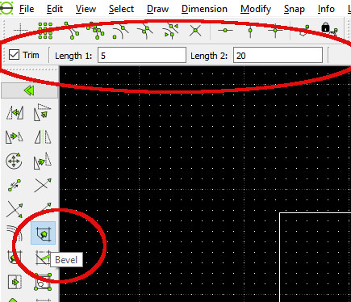

# TIPS & TRICKS FOR BEGINNERS
## by Christian

### Rectangle or 4 lines:
Through my learning process I came to realise that if later you need to use one of the rectangle sides to trim another object this is impossible with a rectangle made as such; on the other hand if you draw it with 4 line segments, or the polygon with 4
sides, then you can trim.

For instance draw a rectangle and an oblique line going through it, then try to trim the line 
to its cross points with the rectangle: possible with 4 lines, impossible with a rectangle.
Should you need to hatch the rectangle it will work either way.

### Bevels and Fillets:
 selecting one of these two will prompt little windows below the 
horizontal icon upper line, the tooll options, they allow to indicate either the bevel 
dimensions or the fillet diameter. It took me a little while to realise they were there.
Many other icons will prompt tool options that will allow to add properties to the command.

### Use of Snaps:
 while drawing a single element one can change the Snap selection 
between points. Here is what I mean: draw a line, say vertical, and a point somewhere; 
you want to draw a new line that will start from the point and end at the centre of the 
vertical line, select 2 Points line and **Snap on Endpoints** then start your line on the point 
drawn, now de-select **Snap on Endpoints** and select **Snap Middle** and end your line in the 
middle of the vertical one.
**NOTE:** you could have selected both Snaps together and it works but this is just an illustration of possibilities.

### Copy & Paste:
just like other programs it allows to copy and paste any element anywhere,
only it is a little surprising.
Draw anything, say a circle. Click on it to select it and either **Edit, Copy** or **Ctrl+C**, note that
the command line says: "*specify reference point*", select the centre of the circle. At this 
stage your screen looks as if you have done nothing. Now do either **Edit, Paste** or **Ctrl+V** 
and start moving you mouse, you see a new circle moving about, click where you want its 
centre to be located.
**NOTE:** you can only paste in the layer you copied from, should you need to move the copy
to another layer read the following chapter; but you can paste in another drawing, to do so 
open the new drawing and only then paste.

###Filet
Moving entity from one layer to another:
 suppose you have drawn an entity in the 
wrong layer, no panic you can correct that: with the icons select **Modify and Attributes** this 
will prompt the Select icon tools, choose one and select the entity to move, either press 
Enter or click on the double arrow below the **Select** icon tools and in the little window that 
opens choose the layer needed in the Layer line (the first on top): DONE.

